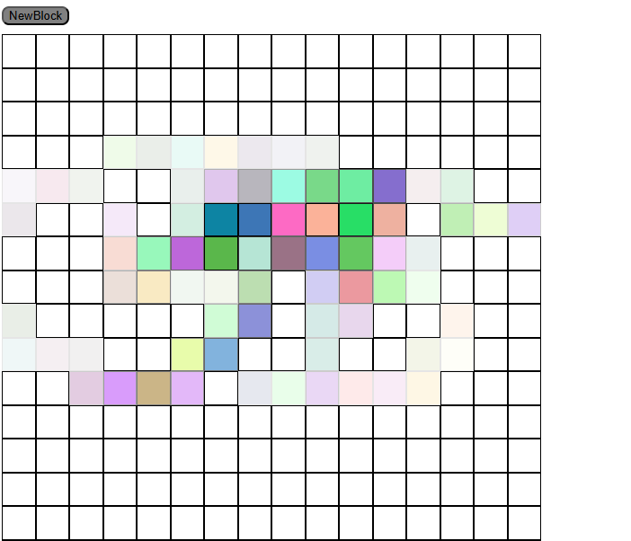

# Etch-A-Sketch

A browser-based drawing toy built with vanilla JavaScript. Draw on a grid 
with random colors and progressive darkening effects.

## 🔗 Live Demo
[View it live](https://miriamromeromon.github.io/etch-a-sketch/)

## ✨ Features
- 16x16 grid created dynamically with JavaScript
- Random RGB colors on each interaction
- Progressive darkening effect (10% per hover until fully opaque)
- Adjustable grid size up to 100x100

## 🛠️ Built With
- HTML
- CSS (Flexbox)
- JavaScript (DOM manipulation)

## 🚀 How To Use
1. Move the mouse over the grid to draw
2. Click **NewBlock** to reset and change the grid size
3. Enter a number between 1 and 100